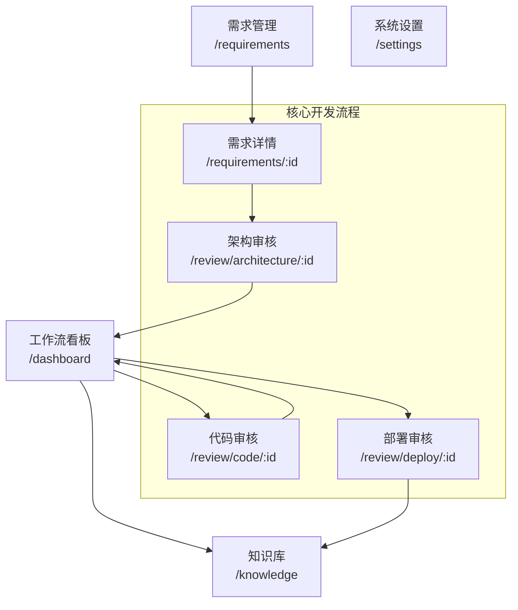

# User Flow — AI DevOps Orchestrator

```mermaid
graph TD
  %% Primary Pages
  Dashboard["工作流看板<br/>/dashboard"]
  Requirements["需求管理<br/>/requirements"]

  %% Core Business Feature - Complete Development Workflow
  subgraph "核心开发流程"
    RequirementDetail["需求详情<br/>/requirements/:id"]
    ArchitectureReview["架构审核<br/>/review/architecture/:id"]
    CodeReview["代码审核<br/>/review/code/:id"]
    DeployReview["部署审核<br/>/review/deploy/:id"]
  end

  Requirements --> RequirementDetail
  RequirementDetail --> ArchitectureReview
  ArchitectureReview --> Dashboard
  Dashboard --> CodeReview
  CodeReview --> Dashboard
  Dashboard --> DeployReview

  %% Secondary Pages
  KnowledgeBase["知识库<br/>/knowledge"]
  Settings["系统设置<br/>/settings"]

  Dashboard --> KnowledgeBase
  DeployReview --> KnowledgeBase
```
